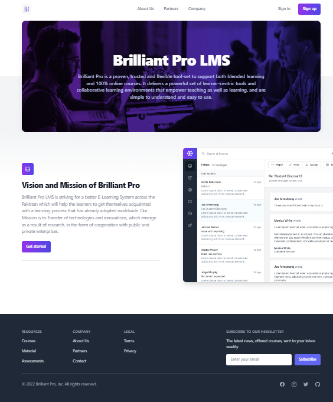

# Brilliant Pro LMS

Introducing Brilliant Pro, an exceptional and versatile toolkit that guarantees an immersive learning experience, whether you're engaging in blended learning or fully online courses. This remarkable platform provides an array of learner-centric tools and fosters collaborative learning environments, empowering both educators and students alike. Its intuitive design ensures a seamless experience, making it effortlessly comprehensible and user-friendly. With a primary focus on creating and managing e-Learning courses, learning materials, and assessments, administrators can effortlessly construct and oversee courses and content, ensuring effective knowledge dissemination.

## Working

The Brilliant Pro LMS works in two different modes for
Admins and Learners respectively.

• Learners are the end-users. These are the users for whom the
training content is designed. They are the recipients of the
training and access the LMS to view learning material and
participate in the course work and assessments, all while
tracking their own progress along the way.

• Administrators are in charge for the management of the LMS,
which includes multiple tasks ranging from course creation,
to learner assignment, to monitoring learner progress.

## Preview

